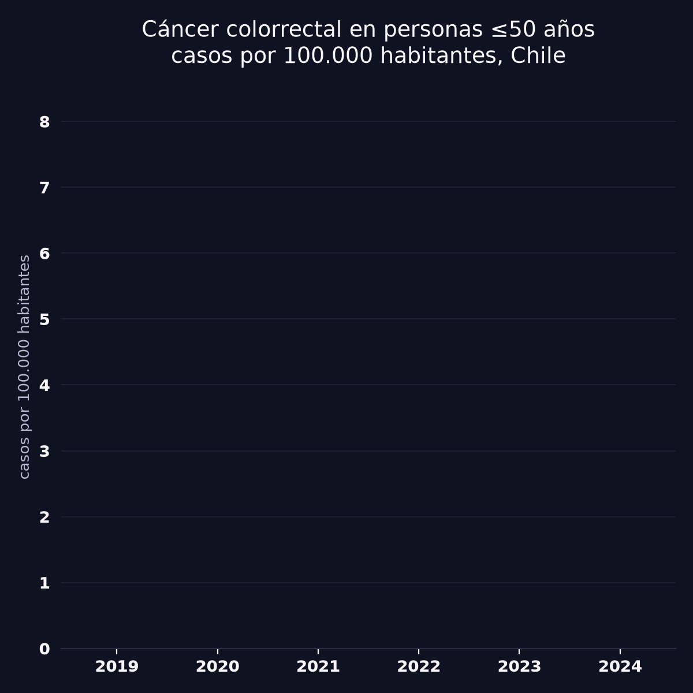
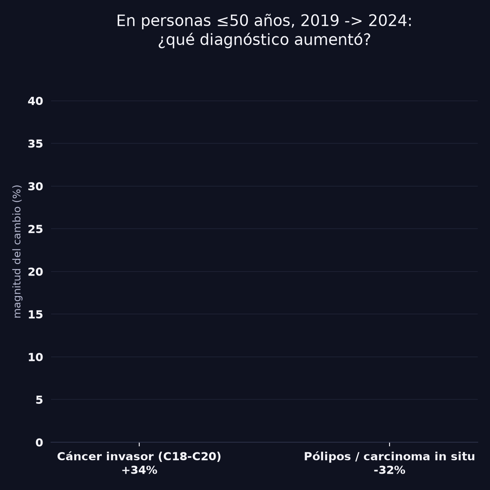
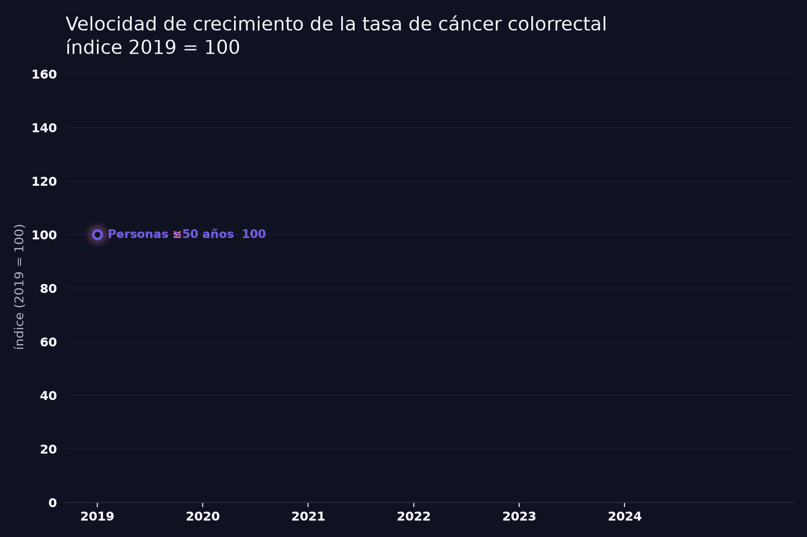
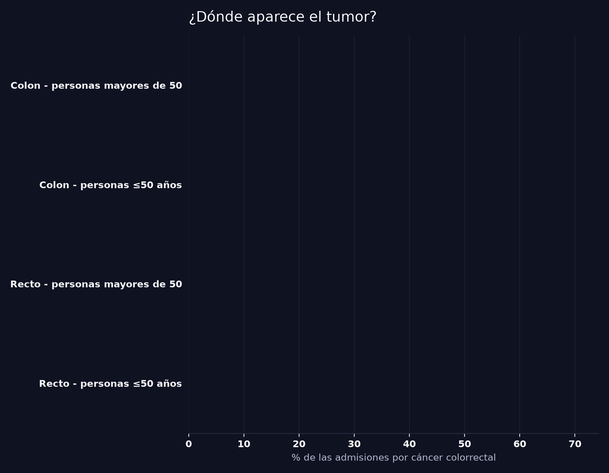

# Cáncer Colorrectal en Personas de 50 Años o Menos en Chile



Análisis de los egresos hospitalarios públicos GRD de Chile (FONASA, 2019-2024) a raíz
de las noticias recientes sobre el fuerte aumento del cáncer colorrectal en menores de 50
años en Chile. El objetivo fue revisar esa alerta con datos propios: ¿la tasa de
hospitalizaciones por cáncer colorrectal en personas de 50 años o menos sube más rápido que
en el resto de la población, y qué tan sólida es esa señal?

## El hallazgo principal: no es más pesquisa, es más cáncer real

La pregunta clave no es solo si suben los casos, sino *por qué*. Un aumento podría deberse a
más tamizaje detectando lesiones tempranas, o a más gente enfermando de cáncer invasor. Para
distinguirlo, se comparó la evolución del cáncer colorrectal invasor (CIE-10 C18-C20) con la
de los pólipos adenomatosos y el carcinoma in situ (las lesiones que el tamizaje está
diseñado para encontrar antes de que se conviertan en cáncer), ambas dentro del mismo grupo
de personas de 50 años o menos.



Entre 2019 y 2024, en personas de 50 años o menos, el cáncer colorrectal invasor **subió
34%** mientras los diagnósticos de pólipos/carcinoma in situ **cayeron 32%**. Si el aumento
viniera de mejor pesquisa, ambas categorías deberían subir juntas. Ocurre lo contrario, lo
que apunta a más cáncer real apareciendo, y detectado tarde, no a un efecto de más
tamizaje.

## Otros hallazgos

- **La tasa por 100.000 habitantes subió en ambos grupos etarios**, pero más en personas de
  50 años o menos (+31,9% entre 2019 y 2024) que en mayores de 50 (+16,7%). Usando 2021 como
  base para evitar el quiebre de la pandemia, ambos grupos crecen a un ritmo parecido
  (~10-11% anual compuesto): parte del salto reciente es recuperación general del sistema
  hospitalario pos-pandemia, no algo exclusivo de los jóvenes, aunque la brecha del período
  completo sigue siendo real.
- **Los jóvenes con cáncer colorrectal llegan más por urgencia** (40,1% contra 38,3% en
  mayores de 50) y **con más tumores en el recto** (30,7% contra 27,5%), dos señales
  modestas pero consistentes con diagnóstico más tardío. En Chile el tamizaje poblacional
  para este cáncer empieza a los 50 años, así que antes de esa edad casi todo el diagnóstico
  depende de que aparezcan síntomas.
- **El 70% de los casos "jóvenes" se concentra entre los 40 y 49 años.** El cáncer
  colorrectal antes de los 30 sigue siendo raro en estos datos.
- **La letalidad intrahospitalaria en jóvenes viene subiendo desde 2021** (1,6% → 3,1%)
  mientras baja en el grupo mayor, pero con solo 11 a 29 muertes por año en el grupo joven:
  es una señal a seguir, no una conclusión firme con este tamaño de muestra.




## Qué es y qué no es este dataset

GRD es un registro de **egresos hospitalarios y cirugía mayor ambulatoria (CMA)**
publicado por FONASA, no un registro poblacional de cáncer:

- Solo capta personas con un episodio de hospitalización o CMA con ese diagnóstico
  principal. Alguien diagnosticado y tratado solo de forma ambulatoria (consulta,
  quimioterapia ambulatoria sin cirugía) no aparece.
- Cubre los hospitales financiados por el mecanismo de pago GRD (72 en total según
  FONASA): la red pública y clínicas en convenio, no el 100% del sistema privado. Dentro
  de esos hospitales, el 99% de las admisiones extraídas tienen FONASA como previsión de
  salud del paciente.
- El número de esos hospitales que reportaron casos de cáncer colorrectal **creció de 59 a
  67** entre 2019 y 2024 (+13,6%), lo que por sí solo ya explicaría parte de cualquier
  aumento en el conteo bruto de casos. Por eso el análisis usa tasas por 100.000
  habitantes (con población proyectada del INE como denominador), no solo conteos.
- El identificador de paciente encriptado sirve para deduplicar dentro de un mismo año, no
  para seguir a una misma persona entre años.

## Metodología

1. **Extracción** (`src/extract_data.py`): lee directamente los archivos GRD públicos
   2019-2024 (~4 GB en total, con `duckdb`) y filtra las admisiones cuyo diagnóstico
   principal (`DIAGNOSTICO1`) corresponde a cáncer colorrectal (C18, C19, C20), cáncer de
   ano (C21), carcinoma in situ (D01) o pólipos adenomatosos (D12.6). Estas cuatro
   categorías se guardan por separado: el análisis principal usa solo cáncer colorrectal
   invasor, y las otras tres sirven de contraste (ver el hallazgo principal).
2. **Denominador poblacional** (`src/extraer_poblacion.py`): descarga el cuadro comunal
   oficial del INE (base 2017) y lo agrega a totales país por edad simple y año
   (2019-2024), para calcular tasas por 100.000 habitantes en vez de solo contar casos.
3. **Análisis** (`analisis_cancer_colorrectal_jovenes.ipynb`): tendencia de tasas,
   comparación de velocidad de crecimiento entre grupos etarios, perfil demográfico, forma
   de llegada al hospital, ubicación anatómica del tumor, letalidad intrahospitalaria, y la
   comparación cáncer invasor vs. pólipos/in situ.

## Limitaciones

- No es un registro poblacional de cáncer, sino de hospitalizaciones públicas: subestima
  casos ambulatorios y del sistema privado puro.
- El crecimiento en el número de hospitales que reportan (59 → 67) es un confusor que no se
  puede descartar del todo, aunque el uso de tasas por habitante lo mitiga en parte.
- 2020 es un quiebre por la pandemia (caída de hospitalizaciones electivas), no una
  tendencia real: se reporta el crecimiento con y sin ese año como base.
- Las comparaciones de letalidad y de cáncer de ano en el grupo joven se basan en conteos
  anuales chicos (11 a 46 casos), sensibles a la variación año a año.

## Herramientas

Python, `duckdb` (extracción SQL sobre los `.txt` crudos), `pandas`, `matplotlib`,
`pillow` (animaciones).

## Cómo reproducir

```bash
python3 -m venv .venv
source .venv/bin/activate
pip install -r requirements.txt

export GRD_DIR="/ruta/a/bases de datos GRD"
python3 src/extract_data.py
python3 src/extraer_poblacion.py
python3 src/generar_figuras_estaticas.py
python3 src/generar_gifs.py
```

Los archivos GRD crudos (varios GB por año) se descargan del
[portal de datos abiertos de FONASA](https://datosabiertos.fonasa.cl/) y no se incluyen en
este repositorio. El parquet ya procesado (`data/crc_admisiones.parquet`, ~500 KB) sí se
incluye, para que el notebook se pueda ejecutar sin descargar nada. El cuadro de población
del INE (~11 MB) tampoco se incluye: `src/extraer_poblacion.py` lo descarga solo.

## Fuentes de datos

- **GRD Público 2019-2024**, FONASA (Fondo Nacional de Salud), egresos hospitalarios y
  cirugía mayor ambulatoria (CMA) de los 72 hospitales financiados por el mecanismo de
  pago GRD. Fuente: [datosabiertos.fonasa.cl](https://datosabiertos.fonasa.cl).
- **Estimaciones y proyecciones de población, base 2017**, Instituto Nacional de
  Estadísticas (INE), cuadro comunal por edad simple y año, agregado a nivel nacional en
  `src/extraer_poblacion.py`.
